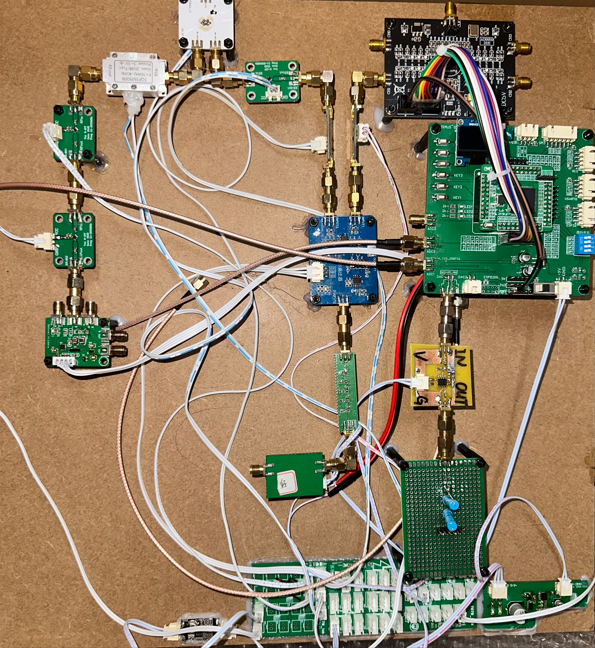
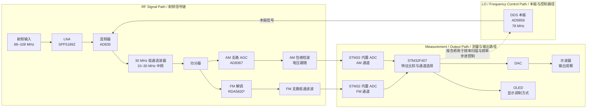
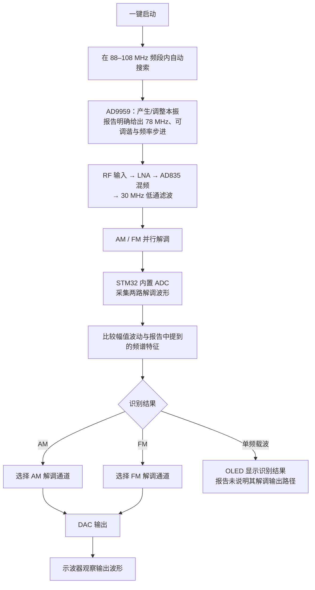
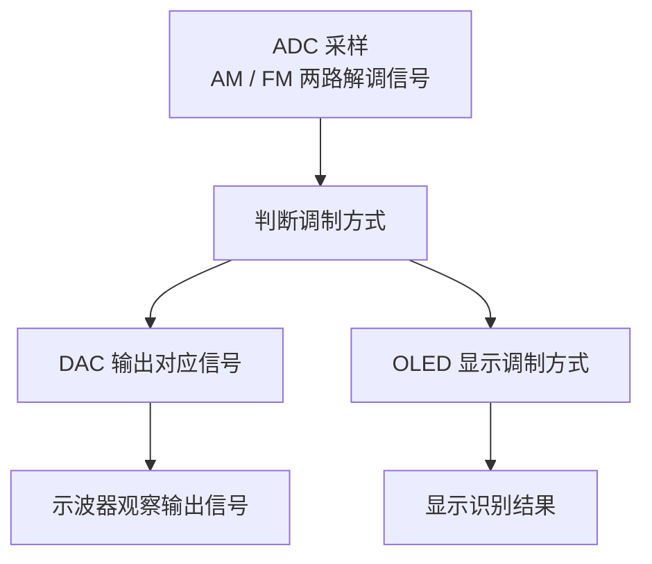

# 简易自动接收机

**Simple Automatic Receiver**

> 2025 年全国大学生电子设计竞赛江苏赛区（TI 杯）F 题

*图：仓库中保留的作品实物搭建照片。*

## 项目简介

本项目面向 2025 年全国大学生电子设计竞赛 F 题“简易自动接收机”，设计了一套工作在 **88–108 MHz** 频段的自动接收系统。系统能够对输入信号进行自动搜索，识别单频载波、AM 或 FM 调制，并选择对应的解调通道输出波形。

系统的射频链路由 `LNA`、`AD9959` 本振、`AD835` 混频器、低通滤波器和功分器组成；功分后的信号分别进入 AM 包络检波通路和 FM 解调通路。`STM32F407` 通过片内 `ADC` 采集两路解调信号，根据波形幅值变化和报告中提到的频谱特征判断调制方式，再通过 `DAC` 输出处理后的信号，并由 `OLED` 显示识别结果。

本仓库定位为该项目的**设计方案与技术报告归档**，主要用于展示系统架构、信号链路、自动识别思路和测试记录。原始 MCU 程序、PCB 原理图工程和 PCB Layout 工程未完整归档，因此本仓库不是一个可以直接编译、复现或二次开发的完整开源工程。

## 设计目标

- 覆盖 `88–108 MHz` 接收频段；
- 自动搜索并识别单频载波、AM 和 FM 信号；
- 对 AM、FM 信号选择相应解调路径并输出解调波形；
- 通过 `AGC` 和输出调理满足题目规定的输出幅度要求；
- 采用单电源 `5 V` 供电，并由 `STM32F407` 完成采样、判断、输出和显示控制。

报告测试表中的任务条件包括：AM/FM 输出信号峰峰值不低于 `0.9 V`、正弦调制信号的输出幅度控制在 `1 V ± 0.1 V`，以及接收机响应时间不超过 `5 s`。这些是报告中的设计要求；测试记录单独列在[测试结果](#测试结果)一节。

## 项目亮点

- **射频下变频链路**：`AD9959` 产生报告明确给出的 `78 MHz` 本振，`AD835` 完成射频信号与本振的乘法混频，混频差频经 `30 MHz` 低通滤波后形成报告所述的 `10–30 MHz` 中频范围。
- **并行解调**：功分后的信号同时进入 AM 和 FM 两条解调路径，为后续的调制方式识别提供两路解调波形。
- **模拟前端增益控制**：`AD8367` 构成 AGC 模块，对进入 AM 包络检波器的中频信号幅度进行调节，降低过强信号失真或过弱信号检波失败的风险。
- **MCU 协同识别**：`STM32F407` 使用片内 ADC 采集 AM、FM 两路解调波形，比较幅值波动和报告中提到的频谱等特征，选择输出通道并驱动 OLED 显示识别结果。
- **自动化测试目标**：报告测试表记录 AM/FM 自动搜索与解调、调制方式显示、低电平信号搜索以及 `≤4 s` 响应时间等项目均标注为完成。

## 系统总体架构

下面的框图依据设计报告图 1、DDS/混频器/AGC 核心部件章节以及程序设计章节整理。图中将 RF 信号流、测量/输出路径和本振/控制路径分开表示。

`*` 报告摘要和图 1 将 FM 解调器写为 `RDA5820`；报告第 1.3 节的 FM 方案比较文字又出现了 `NE564`。本文按摘要和总体框图记录 `RDA5820`，并在[资料边界](#资料边界)中保留这一差异。

图中 `AD8367` 的位置按报告图 1 和“AGC 自动增益电路设计”章节绘制，即位于混频/滤波后的 AM 分支与包络检波之间。报告总体设计段对 AGC 与功分器的先后顺序有一处不同表述，README 采用框图和核心电路章节能够共同确认的连接关系。

## 射频与信号链路

### 射频前端与中频形成

报告方案比较选择了 `LNA + VGA` 类型的宽带接收前端，并明确将 `SPF5189Z` 作为前端低噪声放大器，用于提升输入信号电平、改善后级处理条件。理论分析中以单级典型增益约 `32 dB`、噪声系数低至约 `1.2 dB` 对增益链路进行估算；这属于报告中的理论分析参数，不等同于仓库中可复核的独立器件实测标定。

射频信号经 LNA 后进入 `AD835` 混频器。`AD9959` 产生的 `78 MHz` 正弦波作为本地振荡信号，与输入射频信号进行乘法混频。混频后的差频信号通过 `30 MHz` 低通滤波器，报告将后续中频范围描述为 `10–30 MHz`，再进入功分器形成并行的 AM/FM 解调输入。

### DDS 本振与自动扫频

`AD9959` 在本系统中不是孤立列出的数字器件，而是接收链的本振与调谐控制部件。报告第 3 章明确说明：

- `AD9959` 产生稳定的 `78 MHz` 正弦本振；
- 器件支持精确可调；
- 精确调谐和频率步进用于实现自动搜索与调谐控制。

报告没有给出 DDS 的接口协议、实际扫频步长、驻留时间、粗扫/精扫策略或锁定判据。因此本 README 只说明其在自动搜索中的本振和频率步进角色，不补写不可由报告确认的算法参数。

### AM 解调

AM 通路采用**非相干包络检波**，而不是需要严格载波同步的相干解调。功分后的 AM 分支先经过 `AD8367` AGC，再进入包络检波和电压跟随结构，提取 AM 包络中的幅度信息。报告选择该方案的理由是：题目调制度较低、不易出现过调幅，包络检波可以避免同频同相载波同步，结构更简单、响应更快。

### FM 解调

总体框图中，功分后的另一支路进入 `RDA5820` 完成 FM 解调，解调输出再经过低通滤波后送入 ADC。报告摘要也将 `RDA5820` 列为 FM 专用解调芯片。

报告第 1.3 节的方案比较文字同时出现了 `NE564` 方案，因此本文不进一步扩展 RDA5820 的内部鉴频结构、接口配置或输入频段，只按摘要和总体框图记录其在本项目中的 FM 解调通路作用。

### 信号采集与路径选择

系统没有采用报告中比较过的 FPGA + `AD9226` 方案，而是使用 `STM32` 片内 ADC。报告明确说明，STM32 分别采集 AM 包络检波输出和 FM 解调输出的两路波形，再依据两路信号的幅值波动、频谱等特征判断调制方式，并控制输出路径切换。

报告同时使用了“频谱分析”等表述，但没有给出 FFT 点数、采样率、窗函数或判决阈值。因此这里不将实现描述为一个已经确认的 FFT 识别算法。

## 自动搜索与载波定位

报告能够确认的自动接收逻辑为：系统面向 `88–108 MHz` 频段自动搜索；`AD9959` 提供本振并支持精确调谐/频率步进；STM32 负责系统级频率扫描、调制识别和模拟控制；ADC 采集两路解调波形后进行识别。报告测试表还记录系统可以自动识别单频载波、AM 或 FM，并显示识别结果。

下面的流程图只串联报告明确出现的功能，不虚构“无信号”判定阈值、扫描步长或载波锁定状态机：

### 报告没有明确给出的搜索细节

以下内容在 PDF 中没有形成可复现的参数或伪代码，本项目 README 不将其写成既定实现：

- DDS 的实际频率步进值、扫描速度和频点驻留时间；
- 信号存在/有效载波的 ADC 判定阈值；
- 是否存在粗扫加精扫，以及具体的载波定位流程；
- 识别所用 ADC 的采样率、数据窗口、FFT 配置和判决边界；
- STM32 与 AD9959、AD8367、RDA5820 之间的具体接口协议。

## 调制方式识别

调制识别的工程关系可以概括为：

1. AM 通路输出包络检波波形，FM 通路输出经 `RDA5820` 和低通滤波后的解调波形；
2. STM32 片内 ADC 对两路解调波形进行采样；
3. 程序比较两路波形的幅值波动及报告中提到的频谱特征；
4. 根据识别结果选择对应解调通道，经 DAC 输出，并由 OLED 显示调制方式。

报告测试项目将“单频载波、调频或调幅信号”的自动识别和显示列为一项，并记录为完成。报告没有给出识别准确率、判定阈值或单频载波的后续输出策略，因此不对这些内容作扩展说明。

## 输出幅度自动控制

报告采用 `AD8367` 构成 AGC 模块，位置在混频/滤波后的中频信号与 AM 包络检波之间。其工程作用是根据输入信号强弱调节增益，使进入包络检波器的信号保持在合适范围内，避免输入过强引起非线性失真，或输入过弱导致检波失效。

报告将输出幅度控制目标写为正弦调制信号输出 `1 V ± 0.1 V`，测试表对此项目标注为完成。需要区分的是：报告把 `AD8367` 描述为 AGC 核心，同时把 `DAC` 描述为 STM32 处理后信号的模拟输出；报告没有给出“ADC 测量 → STM32 算法 → DAC 反馈 AD8367”的完整数字闭环框图或控制参数。因此本文将其称为 **AD8367 模拟 AGC + STM32 输出控制**，不将其包装成已被报告证明的数字闭环 AGC 算法。

## 控制流程

设计报告图 5 给出的 STM32 主控程序流程可以直接概括为：ADC 采样、判断调制方式、DAC 输出以及 OLED 显示识别结果。

## 核心器件与模块

| 模块 | 报告明确记录的器件/方案 | 工程作用 |
| --- | --- | --- |
| 控制核心 | `STM32F407` | ADC 采样、调制识别、路径选择、DAC 输出、OLED 显示及系统能耗控制 |
| 本振与频率控制 | `AD9959 DDS` | 产生 `78 MHz` 本振，并支持精确调谐与频率步进 |
| 射频前端 | `LNA`，方案比较中列为 `SPF5189Z` | 提升输入信号电平，改善后级解调条件 |
| 混频器 | `AD835` | 将输入射频与 DDS 本振相乘，完成下变频 |
| 中频滤波 | `30 MHz` 低通滤波器 | 滤除混频后的高频分量，得到报告所述 `10–30 MHz` 中频范围 |
| 分路 | 功分器 | 将处理后的信号送入 AM 和 FM 两条解调通路 |
| AM 解调 | 包络检波 + 电压跟随 | 从 AM 信号中提取幅度包络 |
| FM 解调 | `RDA5820`* | 完成 FM 频率解调，后接低通滤波 |
| 自动增益 | `AD8367` | 调节进入 AM 包络检波器的中频信号幅度 |
| 信号采集 | STM32 片内 ADC，两路解调波形 | 为调制识别和输出选择提供采样数据 |
| 模拟输出 | DAC | 输出 STM32 处理后的解调信号，供示波器观察 |
| 人机显示 | OLED | 显示调制方式识别结果 |
| 供电 | 单电源 `5 V` | 报告摘要记录的系统供电方案 |

报告没有明确记录独立的音频/输出功率放大器、`8 Ω` 负载、DAC 型号、ADC 采样率或完整 PCB 参数，因此本表不补写这些模块。

## 测试结果

下表只提炼设计报告第 5 节测试表中的要求、实验记录和完成状态；没有把题目指标改写成额外的实测数据。

| 测试项目 | 报告中的要求/测试条件 | 报告实验记录 | 状态 |
| --- | --- | --- | --- |
| FM 自动搜索与解调 | 最大频偏 `5 kHz ≤ Δfmax ≤ 75 kHz`；输出信号峰峰值 `≥0.9 V` | 输出信号电压峰峰值 `≥0.9 V` | 完成 |
| AM 自动搜索与解调 | 调制度 `30% ≤ m ≤ 60%`；输出信号峰峰值 `≥0.9 V` | 输出信号电压峰峰值 `≥0.9 V` | 完成 |
| 输出幅度控制 | 正弦调制信号输出峰峰值控制在 `1 V ± 0.1 V` | `1 V ± 0.1 V` | 完成 |
| 调制方式识别 | 自动识别单频载波、FM 或 AM，显示识别结果并解调 FM/AM | 能自动识别并显示 | 完成 |
| 低电平 AM 接收 | 搜索并解调低电平载波 AM 信号 | 能搜索且能解调 | 完成 |
| 响应时间 | `≤5 s` | `≤4 s` | 完成 |

报告第 6 页的增益分析以 `−95 dBm` 作为最低输入信号强度的分析背景；第 9 页测试表对应单元的文字显示为“载波电平≤95 dBm”，未给出更完整的测量条件、误差范围或灵敏度曲线。因此这里保留报告的测试结论，不把它改写成未经补充条件支持的灵敏度实测值。

## 设计报告

[📄 查看完整设计报告](./2025F题设计报告1.0.pdf)

报告 PDF 是本项目的主要技术事实来源，包含：

- 方案比较与总体设计框图；
- AM/FM 调制与解调理论分析；
- DDS、混频器和 AGC 核心电路设计；
- STM32 主控程序流程图；
- 测试要求、实验记录和完成状态。

README 用于快速理解系统，器件连接细节和原始测试表以 PDF 为准。

## 项目成果

- 2025 年全国大学生电子设计竞赛江苏赛区（TI 杯）F 题“简易自动接收机”；
- 省级三等奖。

## 仓库说明

本仓库目前主要保留设计报告、作品实物照片、README 和许可证文件。原始 MCU 程序、PCB 原理图工程及 PCB Layout 工程未完整归档，因此：

- 本项目适合作为射频接收系统方案、模拟电路设计和电赛工程实现的技术展示；
- 仓库不提供可直接编译的 firmware，也不宣称可以从现有文件完整复现硬件；
- README 仅记录设计报告能够支持的系统关系，不根据常见收音机架构补写缺失实现。

## 资料边界

- **FM 器件表述差异**：报告第 1.3 节方案比较文字出现 `NE564`，但摘要和总体框图使用 `RDA5820`。本 README 依据摘要和总体框图采用 `RDA5820`，具体硬件取舍仍应以原始硬件资料为最终依据。
- **AGC 位置表述差异**：报告总体设计段将 AGC 与功分器的先后顺序写得与图 1 不完全一致；图 1 和 AGC 核心电路章节都支持“混频/滤波后、AM 包络检波前”的分支位置，README 按此绘制。
- **未公开的实现细节**：扫描步长、扫描速度、载波判定阈值、ADC 采样率、FFT 参数、外设接口协议、完整 AGC 控制算法、DAC 型号和输出功放级等，均未在报告中形成可核实的完整资料，本文不作猜测。

## License

[MIT License](./LICENSE)
